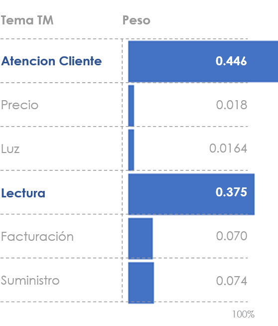
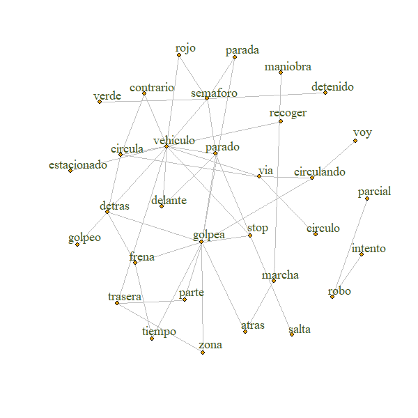

```{r load_packages, message=FALSE, warning=FALSE, include=FALSE}
knitr::opts_chunk$set(echo = FALSE)
library(tidyverse)
library(knitr)
library(kableExtra)
library(scales)
library(lubridate)
library(ggplot2)
library(timevis)
library(widgetframe)
library(png)
library(fontawesome)

```


<script type="text/javascript" async
  src="https://cdnjs.cloudflare.com/ajax/libs/mathjax/2.7.5/MathJax.js?config=TeX-MML-AM_CHTML">
</script>

<script type="text/x-mathjax-config">
MathJax.Hub.Config({
  TeX: { equationNumbers: { autoNumber: "AMS" } }
});
</script>


## Bienvenidos!

<br>
  
  <p style="text-align:right">III CONFERENCIA INTERNACIONAL DE PROCESOS ESTOCÁSTICOS, FENÓMENOS ALEATORIOS Y SUS APLICACIONES</p>
  
  <br>
  
<div class="blue-outline">
  <br>
  <p style="font-family: Piedra; font-size:1.5em; text-align:center">
  "Estadística, matemática y computación para el desarrollo científico e industrial"
</p>
</div>

## Statistics, data, analytics - Dando forma al futuro  


```{r, out.width='95%', fig.align='center'}

```


## Statistics, data, analytics - Desafio, Responsabilidad 


<br>
  
  <div class="purple-outline" style="text-align:center">


 "¡Qué buenos resultados! Eso significa que puedo ahorrar costes cambiando el servicio del equipo de análisis de encuestas por este algoritmo."
<br>
  </div>
  
  

## Bayesian Topic Modelling - Más que un título 

  <br>
  
<div class="columnas">
  <div class="left13">
  <div class="card">
  
  <div class="card-desc">
  <p  style="font-color: #41541e; font-size:1.0em; text-align:center">Discovering topics in documents: Clustering</p>
  </div>
  </div>
  </div>
  
  
  <div class="center13">
  <div class="card">
  
  <div class="card-desc">
  <p style="font-color: #41541e; font-size:1.0em; text-align:center">Convergence of Big Data and Artificial Intelligence</p>
  </div>
  </div>
  </div>
  
  
  <div class="right13">
  <div class="card">
  
  <div class="card-desc">
  <p  style="font-color: #41541e; font-size:1.0em; text-align:center">UC3M: Master in Statistics for Data Science</p>
  </div>
  </div>
  </div>
  </section>
  
## Un dia en el Wanda Metropolitano ... {data-background=#E9E7DA}
  
  ```{r, out.width='85%', fig.align='center'}

```

## Estudiando y Aplicando Estadística desde ...

```{r cv-romy, message=FALSE, include=FALSE,fig.align='center',fig.height=4}

Romy <- data.frame(Year = c(1994, 1997, 2000, 2001, 2006, 2007, 2008, 
                            2017, 2019, 2020 ),
                   Months = c(07, 07, 12, 03, 07, 07, 07, 
                              10, 09, 09 ),
                   Days= c(15, 15, 15, 15, 15, 15, 15, 
                           15, 15, 15 ),
                   Milestones = c("UNALM","UNI","INEI",
                                  "Master, UFRJ","Doctorado, UFRJ", "FIOCRUZ",
                                  "Bayes Forecast","Innova-tsn", "Avanade",
                                  "Nebrija"),
                   Event_type = c("Perú","Perú","Perú",
                                  "Brasil","Brasil","Brasil",
                                  "España","España","España","España")
)
Romy$date<-with(Romy, ymd(sprintf('%04d%02d%02d', Romy$Year, Romy$Months, Romy$Days))) 
#kable(Romy)

Event_type_levels <- c("Perú", "Brasil", "España") 
Event_type_colors <- c("#903163", "#C19434",  "#41541e") 
Romy$Event_type <- factor(Romy$Event_type, levels= Event_type_levels, ordered=TRUE)

# Set the heights we will use for our milestones.
positions <- c(0.5, -0.5, -0.5, 1.0, 0.5, -0.25, -0.5, -0.5, 0.5, -0.5) 
# Set the directions we will use for our milestone, for example above and below.
directions <- c(1, -1, -1, 1, 1, -1, -1, -1, 1, -1)  
# Assign the positions & directions to each date from those set above.
line_pos <- data.frame(
  "date"=unique(Romy$date),
  "position"=rep(positions, length.out=length(unique(Romy$date))),
  "direction"=rep(directions, length.out=length(unique(Romy$date))))
Romy <- merge(x=Romy, y=line_pos, by="date", all = TRUE) 


# Lets offset the labels 0.2 away from scatter points
text_offset <- 0.2 
# Let's use the absolute value since we want to add the text_offset and increase space away from the scatter points 
absolute_value<-(abs(Romy$position)) 
text_position<- absolute_value + text_offset

# Let's keep the direction above or below for the labels to match the scatter points
Romy$text_position<- text_position * Romy$direction 


month_buffer <- 1 
month_date_range <- seq(min(Romy$date) - months(month_buffer), max(Romy$date) + months(month_buffer), by='month')
month_format <- format(month_date_range, '%b') 
month_df <- data.frame(month_date_range, month_format)
year_date_range <- seq(min(Romy$date) - months(month_buffer), max(Romy$date) + months(month_buffer), by='year')
year_date_range <- as.Date(
  intersect(
    ceiling_date(year_date_range, unit="year"),
    floor_date(year_date_range, unit="year")),  
  origin = "1970-01-01") 
year_format <- format(year_date_range, '%Y') 
year_df <- data.frame(year_date_range, year_format)


timeline_plot<-ggplot(Romy,aes(x=date,y= position, col=Event_type, label=Milestones))

timeline_plot<-timeline_plot+labs(col="Milestones") 

timeline_plot<-timeline_plot+scale_color_manual(values=Event_type_colors, labels=Event_type_levels, drop = FALSE) 
timeline_plot<-timeline_plot+theme_classic() 
timeline_plot<-timeline_plot+geom_hline(yintercept=0, 
                                        color = "black", size=0.3)
timeline_plot<-timeline_plot+geom_segment(data=Romy, aes(y=position,yend=0,xend=date), color='black', size=0.2) 
timeline_plot<-timeline_plot+geom_point(aes(y=position), size=3) 
timeline_plot<-timeline_plot+theme(axis.line.y=element_blank(),
                                   axis.text.y=element_blank(),
                                   axis.title.x=element_blank(),
                                   axis.title.y=element_blank(),
                                   axis.ticks.y=element_blank(),
                                   axis.text.x =element_blank(),
                                   axis.ticks.x =element_blank(),
                                   axis.line.x =element_blank(),
                                   legend.position = "bottom"
) 
# Let's add the text for each month
# timeline_plot<-timeline_plot+geom_text(data=month_df, # aes(x=month_date_range,y=-0.15,label=month_format),size=3.5,vjust=0.5, color='black', angle=90) 
# Let's add the years
timeline_plot<-timeline_plot+geom_text(data=year_df, aes(x=year_date_range,y=-0.05,label=year_format, fontface="bold"),size=2.5, color='black') 
timeline_plot<-timeline_plot+geom_text(aes(y=text_position,label=Milestones),size=3.5, vjust=0.6)


# Print plot
#Lprint(timeline_plot)

#library(plotly)
#ggplotly(timeline_plot)

# View head of the table
#kable(Romy)

MCC <- Romy
MCC$start <-MCC$date 
MCC$end<-c(NA, NA, NA, NA, NA, NA,NA, NA, NA,NA) 
# Each milestone will need an ID for visualization and content for labels.
MCC$id<- 1:10
MCC$content<- MCC$Milestones
MCC$group=Romy$Event_type 
MCCgroups = data.frame(id = 1:3, content = c("Perú", "Brasil", "España"))
MCC$style = c(rep("color: #C00000; background-color:#FFFFFF",3), 
              rep("color: #FFC000; background-color:#FFFFFF",3),
              rep("color: #00B050; background-color:#FFFFFF",4))
#MCC$type = rep("background",10)

myTimeline <- timevis(MCC,width = '80%')
#htmlwidgets::saveWidget(myTimeline, "myTimeLine.html", selfcontained = F)
htmlwidgets::saveWidget(frameableWidget(myTimeline ),'myTimeLine.html')
#frameWidget(myTimeline)
```

<div class="columnas">
  <div class="left7">
  
  ```{r cv-romy-plot, message=FALSE, fig.align='left',out.width = '100%'}
library(plotly)
fig <- ggplotly(timeline_plot, tooltip = NULL)
fig <- fig %>% layout(legend = list(orientation = 'h',   # show entries horizontally
                                    xanchor = "center",  # use center of legend as anchor
                                    x = 0.5,y = -0.12))
fig

```
</div>
  
<div class="right3">
  <div class="card">
  
  <div class="card-desc">
  <p  style="font-color: #41541e; font-size:0.5em; text-align:center">[Algo más en mi web](https://romyravines.netlify.app/) </p>
  </div>
  </div>
</div>
  
  
</div>

## Dos sectores - Dos historias reales
  
<div class="columnas">
  
  <div class="left5">
  <div class="card">
  
  <div class="card-desc">
  <p  style="font-color: #41541e; font-size:1.0em; text-align:center"><b>Paquetería</b><br>¿Le gustaría hacer algún otro comentario en relación a los servicios de su empresa? </p>
  </div>
  </div>
  </div>
  
  
<div class="right5">
  <div class="card">
  
  <div class="card-desc">
  <p  style="font-color: #41541e; font-size:1.0em; text-align:center"><b>Energía</b><br>¿Por qué usted no está plenamente satisfecho con su empresa?</p>
  </div>
  </div>
  </div>
  
</section>

## Impacto en el Servicio
  
<div class="columnas">

  <div class="left13">
  <div class="card">
  
  <div class="card-desc">
  <p  style="font-color: #41541e; font-size:1.0em; text-align:center">
  Temas Mencionados</p>
  </div>
  </div>
  </div>
  
  <div class="center13">
  <div class="card">
  
  <div class="card-desc">
  <p style="font-color: #41541e; font-size:1.0em; text-align:center">
  Palabras Utilizadas</p>
  </div>
  </div>
  </div>
  
  <div class="right13">
  <div class="card">
  
  <div class="card-desc">
  <p  style="font-color: #41541e; font-size:1.0em; text-align:center">
  Expresiones Frecuentes</p>
  </div>
  </div>
  </div>
  </section>
  
  <div class="purple-outline">
 "¿Qué recomendaciones concretas doy a los Jefes de Oficina?¿Qué deberían cambiar?"
  </div>


  
## Reducción de Coste

<div class="columnas">
  <div class="left13">
  <div class="card">
  
  <div class="card-desc">
  <p  style="font-color: #41541e; font-size:1.0em; text-align:center">
  Temas y Sentimientos</p>
  </div>
  </div>
  </div>
  <div class="center13">
  <div class="card">
  
  <div class="card-desc">
  <p style="font-color: #41541e; font-size:1.0em; text-align:center">
  Expresiones frecuentes</p>
  </div>
  </div>
  </div>
  <div class="right13">
  <div class="card">
  
  <div class="card-desc">
  <p  style="font-color: #41541e; font-size:1.0em; text-align:center">
  Visión Cliente</p>
  </div>
  </div>
  </div>
  </section>
  
  <div class="purple-outline">
  "Puedo cambiar el servicio del equipo de análisis de encuestas por un servicio cognitivo"
  </div>
  

## Nuestro Reto: Seguro para Coches {data-background=#E9E7DA}
  
{height=210px}
{height=200px}
{height=200px}
{height=200px}
{height=200px}
{height=220px}


## Datos: Describiendo el Siniestro


<section>
  <div class="left-half">
  <ul>
  <li><span class="handwriting_v1">AL DAR MARCHA ATRÁS GOLPEÉ A OTRO VEHÍCULO ESTACIONADO</span></li>
  <li><span class="handwriting_v1">AL ENTRAR A UN APARCAMIENTO REALIZO GIRO A LA IZQUIERDA Y ME GOLPEO CONTRA UN BOLARDO</span></li>
  <li><span class="handwriting_v1">AL SALIR DEL GARAJE HE ROZADO TODO EN LATERAL LADO CONDUCTOR CON UNA COLUMNA</span></li>
  <li><span class="handwriting_v2">VOY CIRCULANDO POR LA VIA Y AL ESTORNUDAR PIERDO EL CONTROL DEL VEHÍCULO Y ME GOLPEO CONTRA LA MEDIANA</span></li>
  <li><span class="handwriting_v2">VOY CIRCULANDO POR LA VÍA FRENO EN EL PASO DE CEBRA  EL VEHÍCULO CONTRARIO NO FRENA A TIEMPO Y ME GOLPEA </span></li>
  <li><span class="handwriting_v2">CIRCULANDO POR LA VÍA SE CRUZA UN PEATÓN SIN MIRAR Y LE ATROPELLO</span></li>
  <li><span class="handwriting_v1">TRASERA DEL COCHE</span></li>
  </ul>
  </div>
  
  <div class="right-half">
  <ul>
  <li><span class="handwriting_v2">CAYÓ UNA GRANIZADA TREMENDA Y ME HA ABOLLADO LA CHAPA DEL COCHE  Y LOS EMBELLECEDORES DE LAS PUERTAS </span></li>
  <li><span class="handwriting_v2">DEBIDO A LAS LLUVIAS TORRENCIALES SE INUNDA MI VEHÍCULO </span></li>  
  <li><span class="handwriting_v1">ENCUENTRO QUE HAN ROBADO EMBELLECEDORES DE LAS CUATRO LLANTAS</span></li>
  <li><span class="handwriting_v1">ROTURA DE CRISTAL POR ROBO</span></li>  
  <li><span class="handwriting_v1">ARAÑAZOS EN EL LATERAL IZQUIERDO POR VANDALISMO</span></li>
  <li><span class="handwriting_v2">ESTOY CIRCULANDO POR LA VIA CUANDO GOLPEO A UN JABALI</span></li>  
  <li><span class="handwriting_v2">CHOQUE FRONTAL CON UNA MACETA</span></li> 
  <li><span class="handwriting_v1">ERROR AL ECHAR GASOLINA AL COCHE EN VEZ DE DIESEL</span></li>
  <li><span class="handwriting_v1">EN UNA EMPRESA DE RECOGIDA DE COCHE EN EL AEROPUERTO</span></li>  
  </ul>
 </div>
</section>


## Datos: Palabras Más Utilizadas

<iframe id="wc2" src="charts/wc2.html"  loading="lazy"  width="70%">
</iframe>


## Datos: Los Problemas de Siempre


<div class="columnas">
  <div class="left13">
  <div class="card">
  
  <div class="card-desc">
  <p  style="font-color: #41541e; font-size:1.0em; text-align:center">
  Documentos con <b>textos relativamente cortos</b>: 14 palabras por texto </p>
  </div>
  </div>
  </div>
  <div class="center13">
  <div class="card">
  
  <div class="card-desc">
  <p style="font-color: #41541e; font-size:1.0em; text-align:center">
  Muchas <b>palabras comunes</b> entre textos con diferente asunto</p>
  </div>
  </div>
  </div>
  <div class="right13">
  <div class="card">
  
  <div class="card-desc">
  <p  style="font-color: #41541e; font-size:1.0em; text-align:center">
  Escritura <b>humana</b>: ortografía, sinónimos, no nativos, etc.</p>
  </div>
  </div>
  </div>
  </section>


## Datos: Expresiones (_Bigram Count Network_) 


  
```{r, out.width='70%', fig.align='center'}

```


## Modelo: *Latent class model (LCM)*

<div class="rmdnote" style="font-family: Encode Sans Semi Condensed; font-size:16px; font-weight:normal; color:#41541e">

 - Clustering of high-dimensional categorical data.
 - LCM: mixture models that assign the set of multivariate categorical observations to a latent class \\( z \\). Within each \\( z \\) the observed variables are statistically independent.
 - LCM estimates the class probability  \\( \\lambda \\) and the probability of observing a particular response for a question conditioned on the latent class.
</div>


<br>

<section>


  <div class="right7">
<div style="font-family: Encode Sans Semi Condensed; font-size:24px; font-weight:normal; color:#41541e">

\\begin{array}{rcl}
 \\lambda | \\alpha & \\sim & \\textrm{Dirichlet}(\\alpha) \\textrm{ or }  \\textrm{Dirichlet Process}(\\alpha) \\\\
 z_i |  \\lambda & \\sim & \\textrm{Multinomial}(\\lambda) \\\\
 U_{j,k} | \\beta & \\sim & \\textrm{Dirichlet}(\\beta) \\\\
 X_{j,k} | U_{j,z_i=k} & \\sim & \\textrm{Multinomial}(U_{j,k})
 \\end{array}
 </div>
 </div> 
 
  <div class="left3">
  <div class="card">
  
  <div class="card-desc">
  <p  style="font-color: #41541e; font-size:0.5em; text-align:center">
  \\( X \\) representa la variable observada. \\( K \\) indica que hay un \\( U_k \\) para cada cluster ( \\(1 \\ldots K) \\) . Hay una asignación de cluster para cada texto ( \\( 1 \\ldots I \\) ). \\( \\lambda \\) es el tamaño proporcional de cada cluster. 
</p>
  </div>
  </div>


  </div>

 
</section>

## Modelo: Objetivo


<section>

  <div class="left7">
  
  ```{r, out.width='100%', fig.align='center'}

```


   </div>
  <div class="right3">
  
 - Agrupar los \\( I \\) **Documentos** en \\( K \\) **Clases**.
 - Identificar ''patrones'' en el uso de las \\( J \\) **palabras**.
 - Analizar la **presencia o no ** - \\( R \\) respuestas - de cada palabra en el documento.
 - \\(K \\) conocido o desconocido.
  
   </div>

 
</section> 
  

## Modelo: quien es quien


\\begin{array}{rcl}
 \\lambda | \\alpha & \\sim & \\textrm{Dirichlet}(\\alpha) \\textrm{ or }  \\textrm{Dirichlet Process}(\\alpha) \\\\
 z_i |  \\lambda & \\sim & \\textrm{Multinomial}(\\lambda) \\\\
 U_{j,k} | \\beta & \\sim & \\textrm{Dirichlet}(\\beta) \\\\
 X_{j,k} | U_{j,z_i=k} & \\sim & \\textrm{Multinomial}(U_{j,k})
 \\end{array}
 
 <br>
 
 <div class="rmdnote" style="font-family: Encode Sans Semi Condensed; font-size:16px; font-weight:normal; color:#41541e">

 - \\( \\alpha,\\beta \\) are hyper-parameters, govern the sparsity of the model. 
 - \\( \\lambda | \\alpha \\) the size of the classes in simple LCM or non-parametric LCM.
 - \\( z \\) contains the latent class assignment for each individual.
 - \\( U \\) 3-way tensor of size \\( J \\times K \\times R\\). Contains the probability for response - **content the word** - \\( r \\) from an individual - **a document** - from class \\( k \\) for question - **the word** - \\( j \\). 
 - \\( X_{j,k} | U_{j,z_i=k} \\) specifies that the response of an individual \\( i \\) that belongs to a class \\( k \\) is drawn from a Multinomial distribution according to the probability vector \\(U_{j,k}\\). 
</div>
 
 
 

## Modelo: inferencia bayesiana (*Joint Distribution*)

<div style="font-family: Encode Sans Semi Condensed; font-size:18px; font-weight:normal; color:#41541e">
\\begin{array}{rcl}
 \\lambda | \\alpha & \\sim & \\textrm{Dirichlet}(\\alpha) \\textrm{ or }  \\textrm{Dirichlet Process}(\\alpha) \\\\
 z_i |  \\lambda & \\sim & \\textrm{Multinomial}(\\lambda) \\\\
 U_{j,k} | \\beta & \\sim & \\textrm{Dirichlet}(\\beta) \\\\
 X_{j,k} | U_{j,z_i=k} & \\sim & \\textrm{Multinomial}(U_{j,k})
 \\end{array}
 
</div>


<div class="rmdnote" style="font-family: Encode Sans Semi Condensed; font-size:18px; font-weight:normal; color:#41541e">

**Simple LCM**

$$ p(\lambda ,z,U,X | \alpha, \beta) = p( \lambda |\alpha) \prod_{i=1}^{I}p(z_i | \lambda) \prod_{j=1}^{J}\prod_{k=1}^{K} p(U_{j,k} | \beta)\prod_{i=1}^{I} \prod_{j=1}^{J} \prod_{k=1}^{K} p(X_{i,j}|U{j,k})^{I(z_i=k)}$$
</div>

<br>

<div class="rmdnote" style="font-family: Encode Sans Semi Condensed; font-size:18px; font-weight:normal; color:#41541e">

**Nonparametric LCM**

$$ p(\lambda ,z,U,X | \alpha, \beta) = \prod_{k=1}^{K_{max}-1}p( \nu_k|\alpha) \prod_{i=1}^{I}p(z_i | \lambda) \prod_{j=1}^{J}\prod_{k=1}^{K} p(U_{j,k} | \beta)\prod_{i=1}^{I} \prod_{j=1}^{J} \prod_{k=1}^{K} p(X_{i,j}|U{j,k})^{I(z_i=k)}$$
</div>


## MixDir - *Scalable Variational Bayes*

<div class="rmdnote" style="font-family: Encode Sans Semi Condensed; font-size:16px; font-weight:normal; color:#41541e">
C. Ahlmann-Eltze and C. Yau, <b>MixDir: Scalable Bayesian Clustering for High-Dimensional Categorical Data</b>, 2018 IEEE 5th International Conference on Data Science and Advanced Analytics (DSAA), Turin, Italy, 2018, pp. 526-539.
</div>


<section>

  <div class="left7">
  
  ```{r, out.width='100%', fig.align='center'}
knitr::include_graphics('imgs/mixdir_clustering_overview.png')
```


   </div>
  <div class="right3" style="font-family: Encode Sans Semi Condensed; font-size:16px; font-weight:normal; color:#41541e">

<br>

 - Paquete en R
 - Utiliza **Variational Inference** = **Scalable** = **Big Data**.
 - Permite:
  - *handle missing data*
  - *infer a reasonable number of latent class*
  - *cluster datasets with more than 70,000 observations and 60 features*
  - *propagate uncertainty and produce a soft clustering*
 
    </div>
</section>    
  


## Manos a la obra {data-background=#E9E7DA}

<section>
<div class="left6">

<div class="rmdnote" style="font-family: Encode Sans Semi Condensed; font-size:18px; font-weight:normal; color:#41541e">

 1. Preparar datos: limpieza, ortografía, tokenización, etc. **(+12k documentos)**
 1. Crear diccionario de **400 palabras** según *tf-idf*
 1. Seleccionar **4000 documentos**
 1. Aplicar MixDir con diferentes configuraciones:
    - Inferir el número de clases latentes \\( k=(5,50,100,200) \\times 5 \\)
    - Evaluar consistencia del *clustering*
    - Evaluar el efecto de la distribución a priori
 1. Seleccionar modelo y Analizar resultados
    - Evaluar tamaño y probabilidad de pertenecia a cada clase
    - Identificar palabras más importantes
    - Realizar previsiones
 1. Comparar con LDA 

</div>
</div>


<div class="right4">

<div ">
  
</div>

</div>


</section>

## ¿Vemos los resultados? {data-background="imgs/curioso.jpg"}

## Sobre el Número de Clases: Consistencia


  ```{r, out.width='70%', fig.align='center'}

```

<div class="rmdnote" style="font-family: Encode Sans Semi Condensed; font-size:16px; font-weight:normal; color:#41541e">

 \\( ARI \\) = *Adjusted Rank Index*  se utiliza para comparar los resultados de *clustering*.
 Para cada documento se estima la probabilidad de pertenecer a cada clase (*soft clustering*). Para obtener \\( ARI \\)  cada documento ha sido asignado a la clase con mayor probabilidad.


</div>


## Sobre el Número de Clases: Hiperparámetro


  ```{r, out.width='70%', fig.align='center'}

```

<div class="rmdnote" style="font-family: Encode Sans Semi Condensed; font-size:16px; font-weight:normal; color:#41541e">

El *alluvial plot* muestra el **efecto sobre la agrupación** al incrementar la penalización de la creación de nuevas clases - \\( \\alpha_1 \\) en el Proceso de Dirichlet como prior. 

Como referencia, utilizamos \\( K_{max} = 5 \\). Las clases pequeñas se unifican según crece el valor del parámetro.

</div>


## Clase  Identificadas

<section>

<div class="right6">
  <div class="card">
 <br>
  
  

  
  </div>
</div>

<div class="left35">

  <div class="card">
  <br>
  
  <br>
  </div>

  <div class="card-note" style="font-family: Encode Sans Semi Condensed; font-size:16px; font-weight:normal; color:#41541e">
 
 - Seleccionamos *k=5* clases latentes.
 - *lambda*  es el vector de probabilidades de las clases.
 - *The method produces probabilistic asignments of individuals to the latent classes.*
 -  Arriba: Número de documentos por clase.
 -  Izquierda: *Clustering Heatmap*
 
  </div>

  
</div>

</section>


## Longitud y Clase


```{r, out.width='70%', fig.align='center'}

```

<div class="rmdnote" style="font-family: Encode Sans Semi Condensed; font-size:16px; font-weight:normal; color:#41541e">

 - Longitud - número de palabras sin *stopwords* - de los documentos en cada Clase.
 - La longitud no se utiliza directamente en el modelo. 
 - *Unsupervised clustering can help uncover interesting underlying structures. One must be careful not to over-interpret the data ... *
 

</div>

## Clase B

<div class="columnas">

<div class="left5" style="font-color: #41541e; font-size:0.7em; text-align:center">

```{r}
# Restore the object
pathout="~/GitHub/Cipefa_2020/Siniestros_MixDir/output/"
filerds = "clustering_results/predictive_word.rds"
result_01 = readRDS(file = paste0(pathout,filerds))
#head(textos)

aa<-result_01[which(result_01$class==2), c("column","probability")]
aa$probability = round(aa$probability,3)
names(aa)=c("Word","Probability")
bb=cbind(aa[1:10,],aa[11:20,])
kable(bb,row.names = FALSE)%>%
  kable_paper("hover", full_width = F) %>% 
  kable_styling(bootstrap_options = "striped", full_width = F, 
                position = "center",font_size =16)

```

<br>

<div style="font-family: Encode Sans Semi Condensed; font-size:14px; font-weight:normal; color:#41541e">

*Predictive features for each of the classes: words that maximize the probability for class k*
$$ argmax_{X_j=r}p(z=k|X_j=r) $$
</div>

</div>

<div class="right5">
<div class="card">
  
</div>

</div>

</div>


## Clase D


<div class="columnas">

<div class="left5" style="font-color: #41541e; font-size:0.7em; text-align:center">

```{r}
# Restore the object
pathout="~/GitHub/Cipefa_2020/Siniestros_MixDir/output/"
filerds = "clustering_results/predictive_word.rds"
result_01 = readRDS(file = paste0(pathout,filerds))
#head(textos)

aa<-result_01[which(result_01$class==4), c("column","probability")]
aa$probability = round(aa$probability,3)
names(aa)=c("Word","Probability")
bb=cbind(aa[1:10,],aa[11:20,])
kable(bb,row.names = FALSE)%>%
  kable_paper("hover", full_width = F) %>% 
  kable_styling(bootstrap_options = "striped", full_width = F, 
                position = "center",font_size =16)

```

<br>

<div style="font-family: Encode Sans Semi Condensed; font-size:14px; font-weight:normal; color:#41541e">

*Predictive features for each of the classes: words that maximize the probability for class k*
$$ argmax_{X_j=r}p(z=k|X_j=r) $$
</div>


</div>

<div class="right5">
<div class="card">
  
</div>

</div>


## Clase E

<div class="columnas">

<div class="left5" style="font-color: #41541e; font-size:0.7em; text-align:center">

```{r}
# Restore the object
pathout="~/GitHub/Cipefa_2020/Siniestros_MixDir/output/"
filerds = "clustering_results/predictive_word.rds"
result_01 = readRDS(file = paste0(pathout,filerds))
#head(textos)

aa<-result_01[which(result_01$class==5), c("column","probability")]
aa$probability = round(aa$probability,3)
names(aa)=c("Word","Probability")
bb=cbind(aa[1:10,],aa[11:20,])
kable(bb,row.names = FALSE)%>%
  kable_paper("hover", full_width = F) %>% 
  kable_styling(bootstrap_options = "striped", full_width = F, 
                position = "center",font_size =16)

```

<br>

<div style="font-family: Encode Sans Semi Condensed; font-size:14px; font-weight:normal; color:#41541e">

*Predictive features for each of the classes: words that maximize the probability for class k*
$$ argmax_{X_j=r}p(z=k|X_j=r) $$
</div>

</div>

<div class="right5">
<div class="card">
  
</div>

</div>

</div>


## Palabras más influyentes


  ```{r, out.width='85%', fig.align='center'}

```


<div style="font-family: Encode Sans Semi Condensed; font-size:16px; font-weight:normal; color:#41541e">

*Measure the loss of information using the Jensen-Shannon divergence*. Medida de la pérdida de calidad del cluster si se elimina la palabra.

</div>


## Relación entre palabras

<iframe id="wc3" src="charts/textos_network_01.html"  loading="lazy" width="600"
        height="400">
</iframe>


## Relación entre palabras más influyentes

<iframe id="wc3" src="charts/textos_network_02.html"  loading="lazy" width="600"
        height="400">
</iframe>


## Etiquetando

```{r, include=FALSE}

library(mixdir)
# Restore the object
pathout="~/GitHub/Cipefa_2020/Siniestros_MixDir/output/"
filerds = "clustering_results/clustering.rds"
clustering1 = readRDS(file = paste0(pathout,filerds))
palabras = c("columna",
             "golpe",
             "golpeo + columna",
             "columna + roce",
             "intento",
             "estacionamiento",
             "tentativa + robo",
             "intento + robo",
             "retrovisores + robo",
             "rotura",
             "rotura + lunas",
             "granizo",
             "granizos",
             "daños + granizos",
             "daños + granizada",
             "motocicleta",
             "golpeo + motocicleta + estacionamiento",
             "salir + garaje + encuentro",
             "stop",
             "ceda + peaton + paro")
set.seed(675)
aux=c(
predict(clustering1, c("columna"=1)),
predict(clustering1, c("golpe"=1)),
predict(clustering1, c("golpeo"=1, "columna"=1)),
predict(clustering1, c("columna"=1,"roce"=1)),
predict(clustering1, c("intento"=1)),
predict(clustering1, c("estacionamiento"=1)),
predict(clustering1, c("tentativa"=1,"robo"=1)),
predict(clustering1, c("intento"=1,"robo"=1)),
predict(clustering1, c("retrovisores"=1,"robo"=1)),
predict(clustering1, c("rotura"=1)),
predict(clustering1, c("rotura"=1,"lunas"=1)),
predict(clustering1, c("granizo"=1)),
predict(clustering1, c("granizos"=1)),
predict(clustering1, c("daños"=1,"granizos"=1)),
predict(clustering1, c("daños"=1,"granizada"=1)),
predict(clustering1, c("motocicleta"=1)),
predict(clustering1, c("golpeo"=1,"motocicleta"=1,"estacionamiento"=1)),
predict(clustering1, c("salir"=1,"garaje"=1,"encuentro"=1)),
predict(clustering1, c("stop"=1)),
predict(clustering1, c("ceda"=1,"peaton"=1,"paro"=1))
)
##for(i in 1:20) aux[i] = round(aux[i],4)
predice = matrix(aux,ncol=5,byrow=T)

prediccion = data.frame(Incluye=palabras, 
                        A=predice[,1],
                        B=predice[,2], C=predice[,3],
                        D=predice[,4], E=predice[,5])

#head(prediccion)
library(kableExtra)
```

<div class="right5">


```{r}
knitr::kable( prediccion[11:20,],digits =3,row.names = FALSE) %>%
  kable_paper(full_width = F) %>%
  column_spec(1, bold = T, border_right = F) %>%
  column_spec(2, background = ifelse(prediccion$A[11:20]>0.80, "rgb(202, 207, 210)", 
                              ifelse(prediccion$A[11:20]>0.40, "rgb(229, 231, 233)", 
                              ifelse(prediccion$A[11:20]>0.20, "rgb(242, 243, 244)", 
                                     "rgb(248, 249, 249)")))) %>%
  column_spec(3, background = ifelse(prediccion$B[11:20]>0.80, "rgb(202, 207, 210)", 
                              ifelse(prediccion$B[11:20]>0.40, "rgb(229, 231, 233)", 
                              ifelse(prediccion$B[11:20]>0.20, "rgb(242, 243, 244)", 
                                     "rgb(248, 249, 249)")))) %>%
  column_spec(4, background = ifelse(prediccion$C[11:20]>0.80, "rgb(202, 207, 210)", 
                              ifelse(prediccion$C[11:20]>0.40, "rgb(229, 231, 233)", 
                              ifelse(prediccion$C[11:20]>0.20, "rgb(242, 243, 244)", 
                                     "rgb(248, 249, 249)")))) %>%
  column_spec(5, background = ifelse(prediccion$D[11:20]>0.80, "rgb(202, 207, 210)", 
                              ifelse(prediccion$D[11:20]>0.40, "rgb(229, 231, 233)", 
                              ifelse(prediccion$D[11:20]>0.20, "rgb(242, 243, 244)", 
                                     "rgb(248, 249, 249)")))) %>%
  column_spec(6, background = ifelse(prediccion$E[11:20]>0.80, "rgb(202, 207, 210)", 
                              ifelse(prediccion$E[11:20]>0.40, "rgb(229, 231, 233)", 
                              ifelse(prediccion$E[11:20]>0.20, "rgb(242, 243, 244)", 
                                     "rgb(248, 249, 249)")))) %>% 
  kable_paper("hover", full_width = F) %>% 
  kable_styling(bootstrap_options = "striped", full_width = F, position = "center",font_size =16)

```

</div>


<div class="left5">


```{r}
knitr::kable(prediccion[1:10,],digits =3,row.names = FALSE) %>%
  kable_paper(full_width = F) %>%
  column_spec(1, bold = T, border_right = F) %>%
  column_spec(2, background = ifelse(prediccion$A[1:10]>0.80, "rgb(202, 207, 210)", 
                              ifelse(prediccion$A[1:10]>0.40, "rgb(229, 231, 233)", 
                              ifelse(prediccion$A[1:10]>0.20, "rgb(242, 243, 244)", 
                                     "rgb(248, 249, 249)")))) %>%
  column_spec(3, background = ifelse(prediccion$B[1:10]>0.80, "rgb(202, 207, 210)", 
                              ifelse(prediccion$B[1:10]>0.40, "rgb(229, 231, 233)", 
                              ifelse(prediccion$B[1:10]>0.20, "rgb(242, 243, 244)", 
                                     "rgb(248, 249, 249)")))) %>%
  column_spec(4, background = ifelse(prediccion$C[1:10]>0.80, "rgb(202, 207, 210)", 
                              ifelse(prediccion$C[1:10]>0.40, "rgb(229, 231, 233)", 
                              ifelse(prediccion$C[1:10]>0.20, "rgb(242, 243, 244)", 
                                     "rgb(248, 249, 249)")))) %>%
  column_spec(5, background = ifelse(prediccion$D[1:10]>0.80, "rgb(202, 207, 210)", 
                              ifelse(prediccion$D[1:10]>0.40, "rgb(229, 231, 233)", 
                              ifelse(prediccion$D[1:10]>0.20, "rgb(242, 243, 244)", 
                                     "rgb(248, 249, 249)")))) %>%
  column_spec(6, background = ifelse(prediccion$E[1:10]>0.80, "rgb(202, 207, 210)", 
                              ifelse(prediccion$E[1:10]>0.40, "rgb(229, 231, 233)", 
                              ifelse(prediccion$E[1:10]>0.20, "rgb(242, 243, 244)", 
                                     "rgb(248, 249, 249)")))) %>% 
  kable_paper("hover", full_width = F) %>% 
  kable_styling(bootstrap_options = "striped", full_width = F, position = "center",font_size =16)

```

</div>


# Objetivo conseguido {data-background="imgs/happy.jpg"}


## ¿Próximos pasos?


```{r, out.width='100%', fig.align='center'}
knitr::include_graphics('imgs/tweetmlops.png')
```


## Lo cierto es ... {data-background=#E9E7DA}

<section>

<div class="right5">

<div class="card">
  <br>
  <p style="font-family: Piedra; font-size:1.0em; text-align:center">
“There’s a huge difference between building a Jupyter notebook model in the lab and deploying a production system that generates business value.” </p>
  <p style="font-size:0.5em; text-align:center">
  **Andrew Ng**. Stanford University. Coursera & deeplearning.ai co-founder </p>
<br>
</div>
</div>

<div class="left5">
<div class="card">
  <br>
  <p style="font-family: Piedra; font-size:1.0em; text-align:center">
 “Kaggle is to real-life machine learning as chess is to war. Intellectually challenging and great mental exercise, but you don't know, man! You weren't there!”  </p>
  <p style="font-size:0.5em; text-align:center">
  **Lukas Vermeer**. Director of Experimentation. Booking.com
</p>
<br>

</div>
</div>
</section>    


<div style="font-family: Encode Sans Semi Condensed; font-size:16px; font-weight:normal; color:#41541e">
```{r, out.width='70%', fig.align='center'}

```
</div>

  
## Muchas más aplicaciones ...
  
{height=160px} {height=160px} {height=160px} {height=160px}
{height=150px} {height=150px} {height=150px}  {height=150px}


<div style="font-family: Encode Sans Semi Condensed; font-size:16px; font-weight:normal; color:#41541e">


**NLP will Shape the Enterprise Industry in 2021** [Analytics Insight](https://www.analyticsinsight.net/how-natural-language-processing-will-keep-dominating-2021/) - November 27, 2020.

*" ... MarketstandMarkets predicts that the NLP market size will grow from USD 10.2 billion in 2019 to USD 26.4 billion by 2024. "*

</div>


## . {data-background="imgs/tweetfinal.png"}


## :: {data-background=#E9E7DA}

<section>
<div class="left6">
```{r, out.width='100%', fig.align='center'}

```


</div>

<div class="right4">


<p style="font-family: Piedra; font-size:1.5em; text-align:left">
Seguimos en Contacto
</p>

<table style="width:80%">
<tr>
    <td> </td>
    <td> </td>
    <td> </td>
</tr>
  <tr>
    <td> `r fa("twitter", fill = "#41541e",height = 50)`</td>
    <td> &nbsp;&nbsp; </td>
    <td> <a href="https://twitter.com/RavinesRomy">@RavinesRomy</a></td>
  </tr>
  <tr> 
    <td>`r fa("github", fill = "#41541e",height = 50)`</td>
    <td> &nbsp;&nbsp; </td>
    <td>https://github.com/RavinesRomy</td>
  </tr>
  <tr>
    <td>`r fa("link", fill = "#41541e",height = 50)`</td>
    <td> &nbsp;&nbsp; </td>
    <td>https://ravinesromy.org/</td>
  </tr>
  <tr>
    <td>`r fa("map-marker", fill = "#41541e",height = 50)`</td>
    <td> &nbsp;&nbsp; </td>
    <td>Madrid, España</td>
  </tr>  
</table>

</div>
</section>
